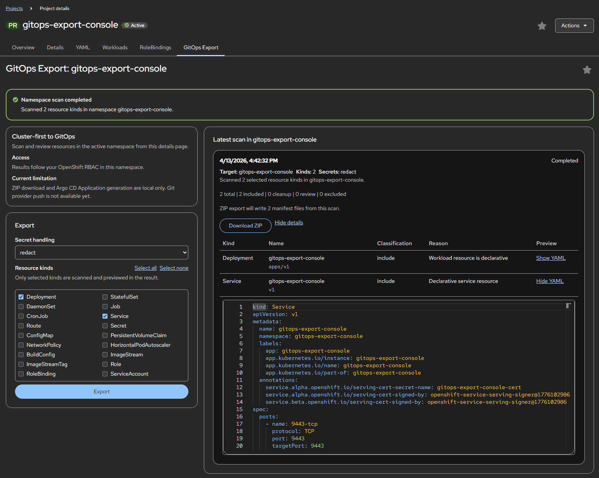
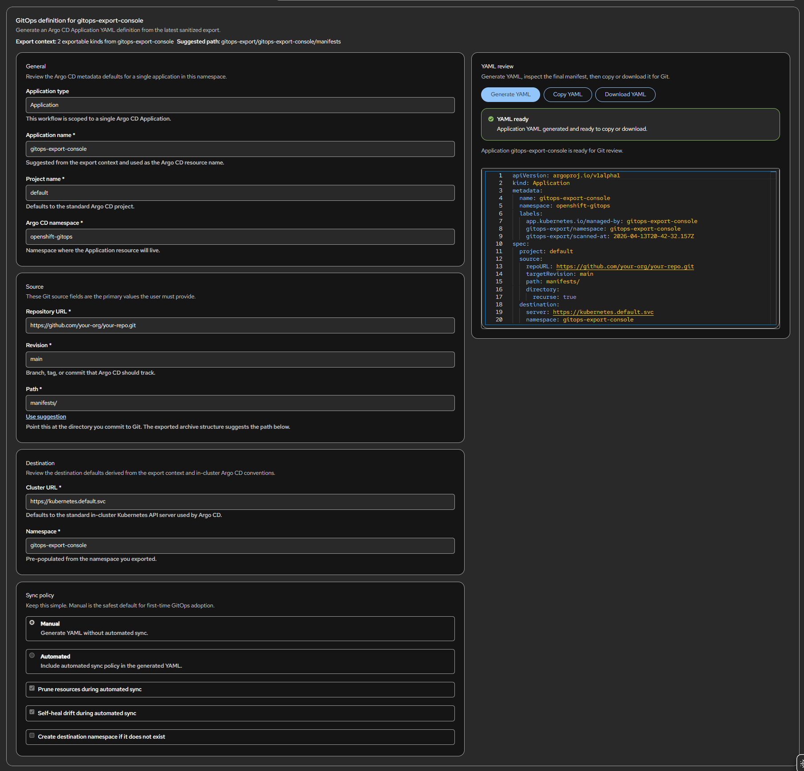

# GitOps Export Plugin

An OpenShift console [plugin](https://docs.redhat.com/en/documentation/openshift_container_platform/4.20/html/web_console/dynamic-plugins#overview-of-dynamic-plugins_customizing-web-console) that helps teams move from cluster-first resource management to GitOps. It scans a namespace, classifies each resource, strips cluster-generated noise from live manifests, produces clean YAML previews, downloads the result as a ZIP archive, and generates Argo CD Application YAML for Git-based rollout.

[](https://www.apache.org/licenses/LICENSE-2.0)


This repository contains the **OpenShift console plugin**. It runs entirely in your browser — install it once per cluster and every user who can access the console can use it with no extra tooling.

## What The Console Plugin Does

- Scans selected resource kinds in a namespace directly from the OpenShift console
- Classifies each resource as **include**, **cleanup**, **review**, or **exclude** with an explanation of why
- Strips cluster-injected metadata, runtime defaults, and controller-owned fields from live manifests
- Renders a sanitized YAML preview for each resource so you can see what a clean export would look like
- Downloads a ZIP archive of the sanitized manifests directly from the browser
- Generates Argo CD Application YAML from the latest sanitized export
- Respects OpenShift RBAC: the plugin only shows resources the current user can list in that namespace
- Offers three secret handling modes: **redact** (default), **omit**, or **include**

## What It Does Not Do Yet

- Push manifests to GitHub or GitLab

## Documentation

| Document | Audience | Description |
|----------|----------|-------------|
| [Docs Home](https://turbra.github.io/gitops-export-plugin/) | All users | Docs-first site with the sidebar, page outline, screenshots, and task paths |
| [Installation](https://turbra.github.io/gitops-export-plugin/getting-started/installation/) | Operators | Deploy, verify, re-apply, and remove the console plugin |
| [First Export](https://turbra.github.io/gitops-export-plugin/getting-started/first-export/) | New users | Scan a namespace, review classifications, and download Git-ready manifests |
| [Concepts](https://turbra.github.io/gitops-export-plugin/concepts/overview/) | Users and contributors | Runtime model, classification, sanitization, output, and security behavior |
| [Reference](https://turbra.github.io/gitops-export-plugin/reference/) | Operators and contributors | Install resources, RBAC, local development, versioning, and testing |
| [Examples](https://turbra.github.io/gitops-export-plugin/examples/) | Operators and contributors | Copy-paste install, RBAC, image build, Argo CD, and validation examples |

The Docusaurus source lives in [`website/`](./website/). Build it locally with:

```sh
cd website
npm ci
npm run build
```

## Quick Start

### Prerequisites

- **OpenShift 4.20 or later** (this branch targets the PatternFly 6 / dynamic-plugin-sdk 4.21 console API). For OpenShift 4.18, use the `feature/ocp-4.18-compat` branch, which pins PatternFly 5 and SDK 4.18.
- `oc` CLI authenticated to the target cluster with `cluster-admin` (for initial install) or permission to create the resources in the install overlay

### Install

```sh
oc apply -k manifests/overlays/install
```

This creates the `gitops-export-console` namespace, deploys the plugin, and runs a one-time Job that registers the plugin with the OpenShift console operator. After the Job completes, refresh the console to see the new **GitOps Export** tab on Project and Namespace detail pages.

### Use

1. Open a **Project** or **Namespace** in the OpenShift console.
2. Select the **GitOps Export** tab.
3. Choose which resource kinds to scan and how to handle Secrets.
4. Click **Export**.
5. Expand the scan result to review classifications and YAML previews, download a ZIP archive of the sanitized manifests, or generate Argo CD Application YAML for Git.
   The ZIP includes `README.md`, optional `WARNINGS.md`, and manifests grouped into `manifests/include/`, `manifests/cleanup/`, and `manifests/review/`. The Application form pre-populates the in-cluster destination server, scanned namespace, `openshift-gitops` namespace, `default` project, and manual sync mode so you can adjust only the Git-specific inputs.

### Screenshots

<p>
  <a href="./website/docs/assets/gitops-export-result.png">
    
  </a>
  <a href="./website/docs/assets/gitops-export-argocd.png">
    
  </a>
</p>

### Remove

```sh
oc delete -k manifests/overlays/install
```

## Building and Publishing the Plugin Image

```sh
VERSION="$(./hack/version.sh)"
IMAGE_TAG="$(./hack/image-tag.sh)"
podman build --build-arg GITOPS_EXPORT_VERSION="${VERSION}" \
  -t docker.io/<your-org>/gitops-export-console:"${IMAGE_TAG}" .
podman push docker.io/<your-org>/gitops-export-console:"${IMAGE_TAG}"
```

After pushing, update the image reference in `manifests/base/kustomization.yaml` and re-apply the overlay. If the previous `gitops-export-console-install-patcher` Job is still present, delete it first or wait for its 300-second TTL cleanup window to expire.

`hack/image-tag.sh` converts the build version into a registry-safe image tag and can also prefix feature-branch builds so they do not replace the mainline tags:

```sh
GITOPS_EXPORT_IMAGE_TAG_PREFIX=pf-i18n- ./hack/image-tag.sh
```

## Local Development

Use the standard OpenShift dynamic-plugin split-terminal workflow.

Terminal 1:

```sh
yarn install
yarn start
```

Terminal 2:

```sh
oc login <cluster-url>
yarn start-console
```

If you prefer `npm`, this repo keeps equivalent commands available: `npm install`, `npm run start`, and `npm run start-console`.

When UI text changes, refresh the English message catalog before committing:

```sh
npm run i18n
```

## Versioning

Release versions are derived from git tags. Create tags in `vX.Y.Z` format.

| Checkout state | Resulting version |
|---|---|
| Exactly on a `vX.Y.Z` tag | `X.Y.Z` |
| N commits after a tag | `X.Y.Z-dev.N+<sha>` |
| No release tags exist | `0.0.0-dev+<sha>` |

Use `hack/version.sh` (shell) or the `version.ts` module (webpack build) to compute the version from a checkout.

## scrubctl CLI

> **Moved.** The `scrubctl` CLI now lives in its own repository: **[github.com/turbra/scrubctl](https://github.com/turbra/scrubctl)**
>
> Install: `go install github.com/turbra/scrubctl/cmd/scrubctl@latest`
>
> Documentation: [turbra.github.io/scrubctl](https://turbra.github.io/scrubctl/)
>
> The old install path (`go install github.com/turbra/gitops-export-plugin/cmd/scrubctl@...`) is deprecated and will stop working once the Go source is removed from this repository.

## License

[Apache License 2.0](https://www.apache.org/licenses/LICENSE-2.0)
